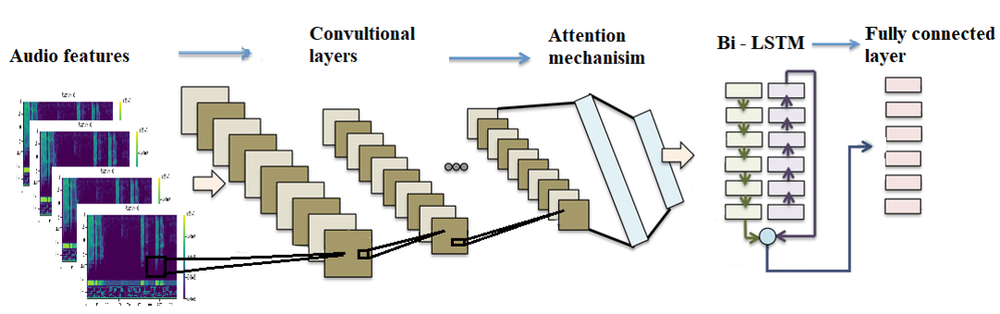

# Coughvid-19-CRNN-attention
**For Vietnamese students, you can read the `Nhận diện covid qua tiếng ho.pdf` and `Covid19_slide.pdf` that are written in Vietnamese. For foreign readers, I wrote all the important information in `coughvid-19-crnn-attention.ipynb`, `Mechanism of cough.pptx`, and my last Git Repo [COVID-19-Cough-Classification-phase-1](https://github.com/mrzaizai2k/COVID-19-Cough-Classification-phase-1-#covid-19-cough-classification-phase-1)**

The Kaggle notebook: https://www.kaggle.com/bomaich/coughvid-19-crnn-attention

You may find the advantages of the Covid classification system based on cough sound, the background technique like scaling, K-fold... or the way I implemented it in **my Git  [COVID-19-Cough-Classification-phase-1](https://github.com/mrzaizai2k/COVID-19-Cough-Classification-phase-1-#covid-19-cough-classification-phase-1)**. But the last git has some huge flaws due to the lack of experiences about cough or I have to depend much on the processed dataset (not sound files). In this Git, I recommend reading this Git in conjunction with `coughvid-19-crnn-attention.ipynb`  

## Table of contents
* [1. Cough mechanism](#1-Cough-mechanism)
* [2. Primary features](#2-Primary-features)
* [3. Model](#3-Model)
* [4. Data augmentation](#-Data-augmentation)
* [5. Result](#5-Result)
* [6. Conclusions](#6-Conclusions)

## 1. Cough mechanism
I won't talk much about this part cause you can have detail information in `Mechanism of cough.pptx` and this [Cough sound analysis and objective correlation with spirometry and clinical diagnosis](https://www.researchgate.net/publication/340025267_Cough_sound_analysis_and_objective_correlation_with_spirometry_and_clinical_diagnosis). To sum up, different diseases create different coungh sounds. And those sounds are different with:
* The energy of cough sequence
* The energy distribution between cough bouts 
* The sound of breath
* The duration of the coough or breath 
and so on 

So I discovered the author of the dataset of **my last Git [COVID-19-Cough-Classification-phase-1]** calculate the mean value of all the features on all of the time series, which was a significant error. Like we just have one ZCR mean value on the whole sound. It's not logical because ZCRs are often utilized in association with energy to determine when there is sound and when there is quiet 
>"The results suggest that zero crossing rates are low for voiced part and high for unvoiced part where as the energy is high for voiced part and low for unvoiced part."

[Separation of Voiced and Unvoiced using Zero crossing rate and Energy of the Speech Signal](https://www.researchgate.net/publication/259828967_Separation_of_Voiced_and_Unvoiced_Speech_Signals_using_Energy_and_Zero_Crossing_Rate)

**From the base knowledge, I decided to use CRNN (Because of it's outperformance inn dealing with series data) and preprocess features in a different way**

## 2. Primary features

I will extract 2D features like:

* Mel-frequency Spectrogram
* Chroma

And then combine them into image to feed into the model. I may add 1D features and mean them through time (not mean them on the whole audio like phase 1):

* MFCCs (I think it's a lower resolution and noise-free version of Mel spectrogram)
* Spectral Centroid
* Spectral Bandwidth
* Spectral Roll-off
* ZCR + energy

Finally, I concatenated all of those features into one image like this below:

<i>Figure 1. Features data </i>

I'd want to go through the Mel-frequency Spectrogram and MFCCs in further detail. A sound is just a collection of waveforms with varying **Amplitude** and **Frequency**. Ah, it sounds familiar, don't it?  Yes Fourier Transform. So we utilize Fourier to encode a sound wave into a picture, which is a Mel-frequency Spectrogram with frequency as the vertical axis, time as the horizontal axis, and magnitude as the sample value associated with each time and frequency coordinate, and yes, we can restore any sound with that image.

The reason why I said MFCCs is a lower resolution and noise-free version of Mel spectrogram is that from the Mel-spectrogram we can remove parts of the frequency and retain a range of frequency that seems to carry important information (That's how we remove noise = high frequency)

## 3. Model

 

 
<i>Figure 2. Model Structure </i>

The [Features images](#2-Primary-features) are then normalized, resized, padding and transposed  before being fed into the model

The four main stages of the model:
* CNN: extract image features (I use CNN of VGG16 with 7 interlaced connected layers of Convolutional, Max pooling and Batch normalization )
* Bi-LSTM: work so well with sequence data. Overcome the RNN drawbacks (vanishing or exploding gradient). The prefix "Bi" stands for "BiDirectional" which indicates that the model can update the current information using both prior and subsequent information.
* Attention: Note that even LSTM struggles with information that appears to be far away. [Attention](https://lilianweng.github.io/lil-log/2018/06/24/attention-attention.html) is here to help
* Fully - connected layer: to classify the matrix of the LSTM output into 2 classes (covid and non-covid)

## 4. Data augmentation

As I said in the [Cough mechanism](#1-Cough-mechanism).There are several elements that might influence the outcome. As a result, using MIX UP (Cut the cough sequeces of several people and then randomly connect them) or SMOTE like phase 1 to deal with the data imbalanced problem isn't a good idea. Cause they will create fake data that may never exist in real life and that doesn't help at all.

Methods that I used:

* Time Shift
* Adding background noise
* Stretching the sound (just a little bit)
* Changing Gain

**Note:** You have to use data augmentation on just the train and valid set, not the test set

**AUC increase from 0.67 to 0.69 after using Data Augmentation**

 

 
<i>Figure 3. AUC on original data </i>

 

 
<i>Figure 4. AUC on augmented data </i>

 
## 5. Result

See more in `coughvid-19-crnn-attention.ipynb`

## 6. Conclusions
I believe the project's basic theory is reasonable, however the results are disappointing. I wish I have had more time cause I was working on my thesis too. Here are some of my ideas for you guys to try on
* I believe MFCCs and Mel-spectrograms are similar in certain ways. . I guess we can just use MFCCs
* I used MFCCs to remove noise before adding noise for data augmentation?? Furthermore, Attention can not properly work with noise. Furthermore, Attention is unable to function well in the presence of noise according to [Joint CTC - Attention based end to end speech recognition using multi - task learning](https://arxiv.org/abs/1609.06773). So, I believe we can remove gauss noise from data augmentation while still achieving the same, if not better, results. However, depending on your definition of noise, may be we can add different sounds (fan, conversation, car engine, etc.) to the mix.
* Yes! I need more data. Obviously, 1369 files is not enough
* Combine with other common symtoms like fever...
* Using other features to find out if they're related to the cough sound
